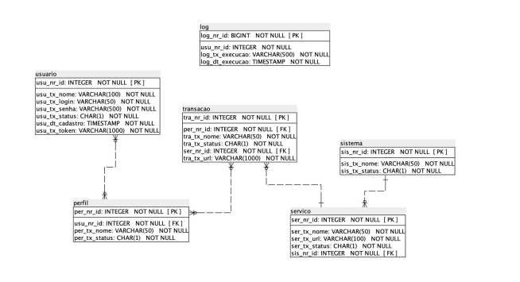

<h1 align="center">Projeto de Segurança Integrada - Web 1</h1>

Projeto Rest API capaz de autenticar e autorizar usuário em execuções de tarefas de qualquer outro sistema. (Spring Boot, Lombok, Spring Security e JWT Token). Desenvolvido para matéria de PROGRAMAÇÃO WEB I

 <a href="#DER-do-projeto">DER do projeto</a> •
 <a href="#Banco-de-dados">Arquivo SQL do Banco de dados</a> • 
 <a href="#Links-Postman-já-criados">Links Postman já criados</a> • 
 <a href="#Mais">Mais</a> • 

### DER do projeto
<h1 align="center">
  
</h1>

### Banco de dados
  * [Link](https://github.com/Rondleysg/Projeto-Portal-de-Seguranca-Integrada/blob/main/assets/db_projectweb.sql)

### Links Postman já criados
  * [Link](https://github.com/Rondleysg/Projeto-Portal-de-Seguranca-Integrada/blob/main/assets/projeto_web.postman_collection.json)

### Mais
O sistema “Portal Segurança Integrada” deve permitir que qualquer projeto, web, desktop ou mobile, possa ser controlado no tocante à autenticação, autorização e auditoria de maneira que os desenvolvedores possam utilizar qualquer linguagem no projeto cliente.

<h4 align="center"> 
	Project Web 🚀 Concluido.
</h4>
